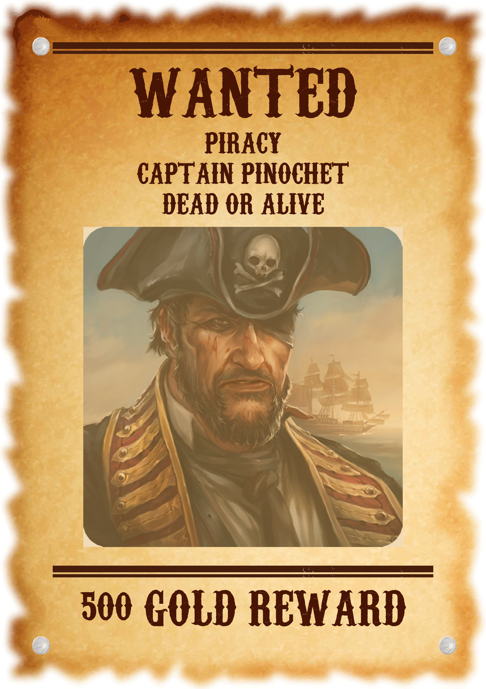

# The Wicked Goat tavern

On the wall next to the door at the Wicked Goat sits a notice board, news and requests can be posted on this board by anyone and everyone.


Currently the following requests are displayed:

## Pirate activity increased!

The mariners guild is offering a reward for Captain Pinochet (dead or alive). He has intruded on Saltmarsh waters and has been looting trading caravels aggressively. 

Contact any officer of the guild for more information and negotiations.


## Apothecary supplies: 

The apothecary requires rare supplies from the underdark, the expedition sent to gather the last set of supplies has not returned. 

Contact the apothecary for more information

## The twin witches: (puzzle RP heavy session)

A traveller met two witches, he says that they asked him to kill one of them but he could not find the strength to do so and made an vow to post a request on the notice board, seek the traveller out at the Empty Net tavern for more information

## Troll trouble:
The troll population in the marshes has grown out of control and the patrols can no longer venture close enough. There are rumours that they are working together under a warchief and organising. Adventurers are required to investigate these rumours


## The miners union (risk of character death or TPK)
The lowest levels of the local mines have been sealed off. The dwarfs have reported strange noises echoing through the caverns, many miners were left without a job. They have put together their meagre earnings to hire a scouting group to investigate the mines

## Trouble in Maarlith: (multi session adventure, requires commitment)
A few letters arrived from the nearby fishing village of Maarlith, the officials of saltmarsh are worried about the hidden messages within.
Here's an exact copy of the letter received:

```
Good tides to Saltmarsh!

We wanted to express our gratitude for the latest shipment of ore. 
Our blacksmith has been quite HEctic since the transport arrived. 
IS there any possibility for you to send us some human support, it seems that our fishermen are not as productive as they used to be, a small ship bearing the flags of saltmarsh stopped nearby and was WATCHING over our fisher boats for the past tendays but they left in a hurry just a few nights ago giving US no explanation.

Thank you kindly, 
Cordast Chin of Maarlith
```
Please talk to Anders Solmor for more information.